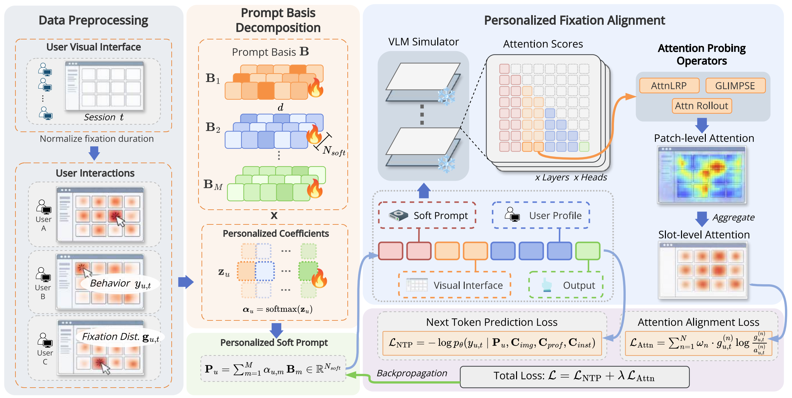

# 👁️ FixATE: Fixation-Aligned Tuning for Personalized User Emulation
[](https://github.com/santideleon/RecGaze_Dataset)
[](https://github.com/kayhan-latifzadeh/AdSERP)

---

This repository contains the official implementation of the paper:

> **Through Their Eyes: Fixation-aligned Tuning for Personalized User Emulation**
>
> *ACM Multimedia 2026 — Brave New Ideas Track*

We propose **FixATE**, a framework that aligns a frozen VLM's visual attention with each user's characteristic gaze pattern through interpretability-based probing and personalized soft prompt tuning, enabling more faithful user simulation in visual recommendation scenarios.

<p align="center">
  
</p>

## 📚 Contents

- [Overview](#overview)
- [Data Preparation](#data-preparation)
- [Training](#training)
- [Evaluation](#evaluation)
- [Project Structure](#project-structure)

## 🔍 Overview

Existing LLM-based user simulators perceive recommendations through text or structured metadata, missing the visual attention signals that drive real user behavior. **FixATE** bridges this gap by:

1. **Probing** the VLM's internal visual attention via interpretability operators (Attention Rollout, GLIMPSE, AttnLRP) to obtain slot-level relevance distributions comparable with human fixation.
2. **Learning personalized soft prompts** through a factorized basis decomposition, steering the model's attention toward each user's characteristic fixation pattern.

<p align="center">
  
</p>


### Dependencies

- PyTorch >= 2.1
- Transformers >= 4.40
- Two supported VLM backbones:
  - [Qwen3-VL-4B-Instruct](https://huggingface.co/Qwen/Qwen3-VL-4B-Instruct)
  - [InternVL3.5-4B-Instruct](https://huggingface.co/OpenGVLab/InternVL3_5-4B-Instruct)

## 📦 Data Preparation

Download [RecGaze](https://github.com/santideleon/RecGaze_Dataset) and [AdSERP](https://github.com/kayhan-latifzadeh/AdSERP) into `datasets/` (e.g. `RecGaze/`, `Adserp/`).

**RecGaze**

```bash
python preprocessing/recgaze/dataset_preprocess_swipes.py
python preprocessing/recgaze/generate_interface_iamge.py 1-35
```

Raw inputs for the second step: `datasets/raw/RecGaze/` (`summary_feedback.csv`, `item_features.csv`, `poster_cache/`). Outputs: `datasets/RecGaze/init_interface_user_gaze(swipes).csv` and `datasets/RecGaze/interface_iamge/*.png`.

**AdSERP (optional)**

```bash
python preprocessing/adserp/build_samples.py --mode both --n 5
python preprocessing/adserp/build_click_aoi_dataset.py --split all
```

## 🔧 Training

Run from the **repo root**. Hyperparameters are in `config/common_config.py` and operator-specific files (`config/attnlrp_config.py`, `glimpse_config.py`, `rollout_config.py`, `attnlrp_config_adserp.py`). Put VLM weights under `llm_models/` (paths in `common_config.py`).

**RecGaze**

```bash
python fixate/fixate_training/train_fixate_attnlrp.py      # AttnLRP
python fixate/fixate_training/train_fixate_glimpse.py      # GLIMPSE
python fixate/fixate_training/train_fixate_rollout.py      # Attention Rollout
```

**AdSERP**

```bash
python fixate/fixate_training/train_fixate_attnlrp_adserp.py
```

Edit `MODEL_TYPE` / `MODEL_NAME` and training knobs in the configs above; there is no `train.py` CLI.

## 📊 Evaluation

Metrics are reported at the end of each training run (JSON under `outputs/` / `checkpoints/` per `config/`). We report attention alignment (e.g. KL / JS, cosine, click@gaze overlap) and prediction quality (accuracy, log-loss, AUC) where applicable.

## 📁 Project Structure (high level)

```
├── config/                 # Training hyperparameters & paths
├── datasets/               # RecGaze / AdSERP data
├── fixate/                 # Core library + training scripts (fixate_training/)
├── preprocessing/          # Dataset-specific preprocessing
├── llm_models/             # Local VLM checkpoints (optional path)
├── outputs/                # Metrics / logs
└── requirements.txt
```

## 🙏 Acknowledgements

- [RecGaze](https://github.com/deleMartinez/RecGaze) for the eye-tracking dataset in carousel-based recommendation
- [AdSERP](https://github.com/nicolo-mn/ad-serp) for the eye-tracking dataset in sponsored search
- [Qwen3-VL](https://github.com/QwenLM/Qwen2.5-VL) and [InternVL](https://github.com/OpenGVLab/InternVL) for VLM backbones
- [GLIMPSE](https://github.com/gxshen/GLIMPSE), [AttnLRP](https://github.com/rachtibat/LRP-eXplains-Transformers), and [Attention Rollout](https://github.com/samiraabnar/attention_flow) for interpretability operators